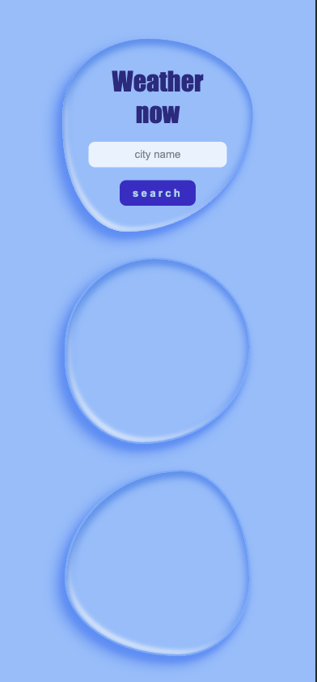
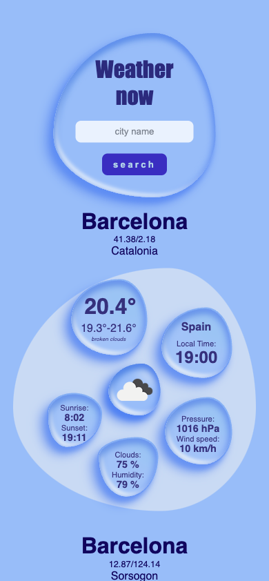
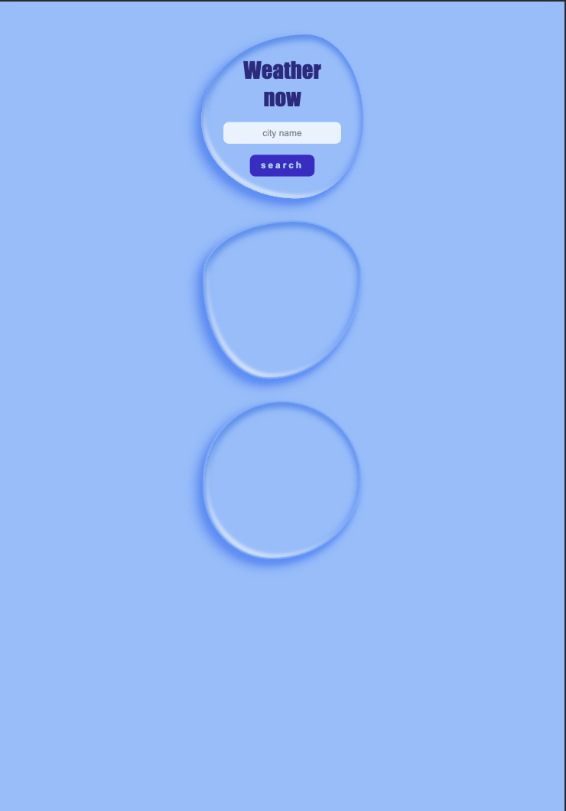
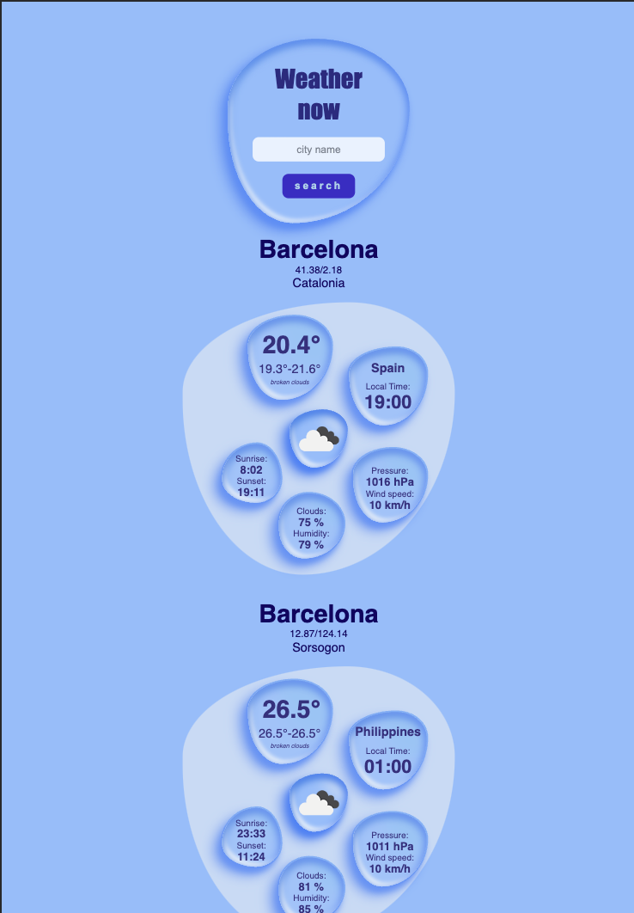
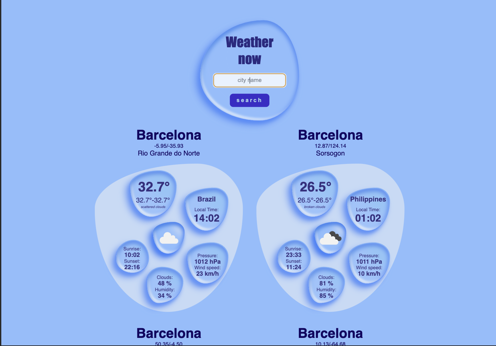
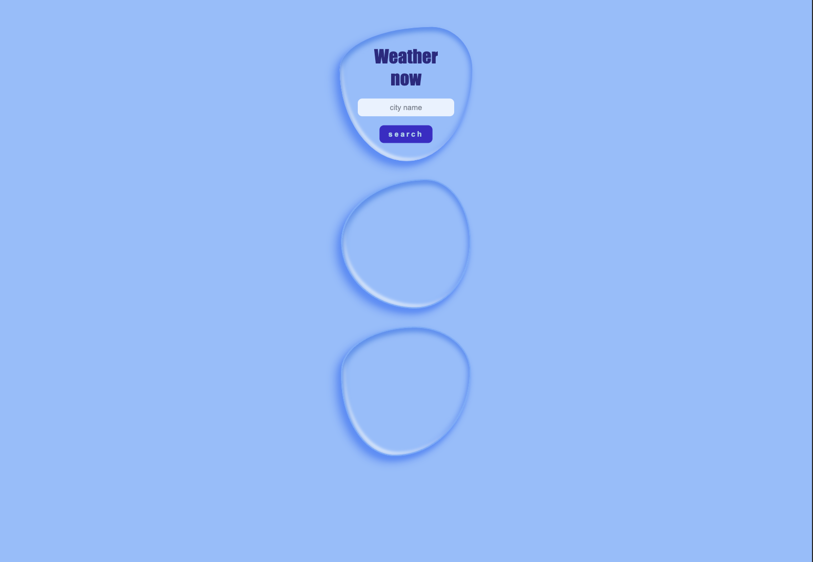
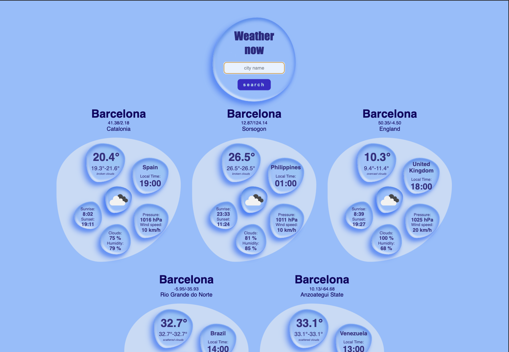

# Weather - App (Api)

# [NETLIFY deployment](https://main--cool-vacherin-47a2af.netlify.app/)

# Api Weather: https://openweathermap.org

# Api Local Time : https://ipgeolocation.io/

Normally I would store the secret api_key in an .env file (.gitignore), but for deployment I would need a server. So as I use a free service key, it is not necessary for this repository. I mean, in this case the key is public. I also added this to the html

```
<meta http-equiv="Content-Security-Policy" content="upgrade-insecure-requests"/>

```

to let me deploy. But normally you should NEVER make the KEYS public. I used this time the NETLIFY deployment

# MOBILE

<div>


</div>

# TABLET & SMALL SCREENS

<div>



</div>

# DESKTOP

<div>


</div>
